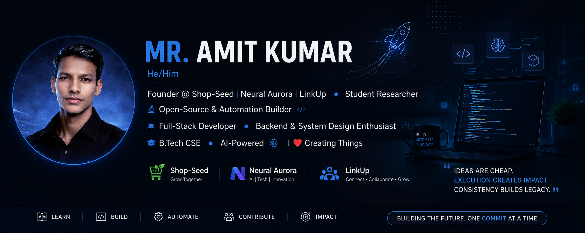
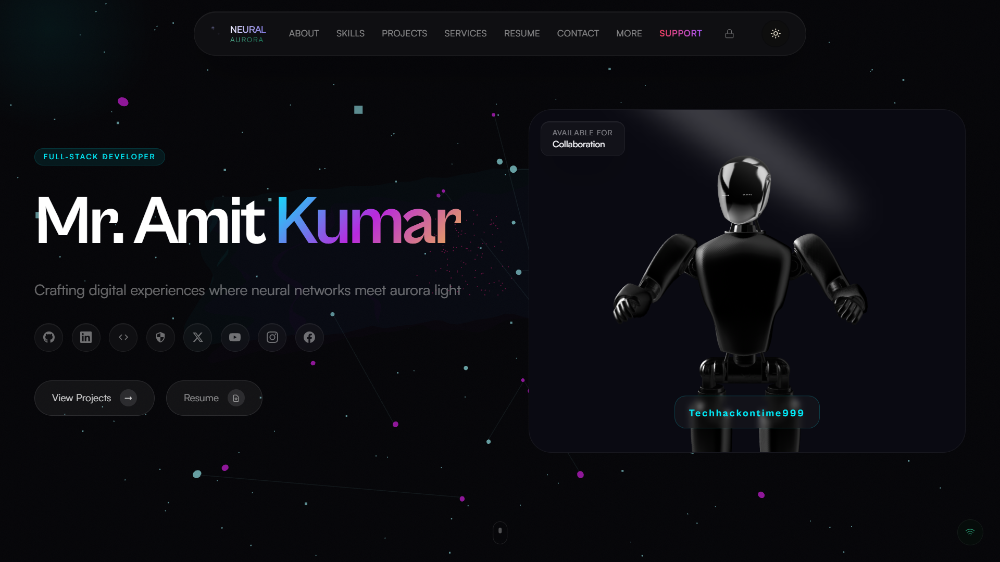
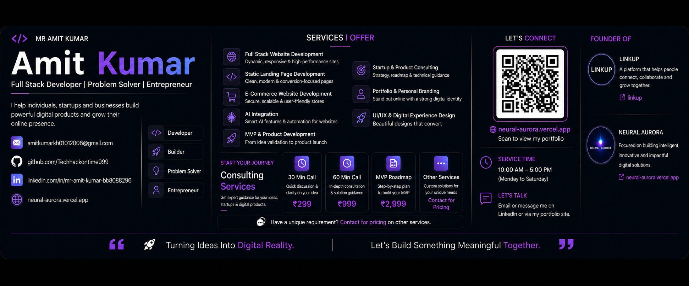
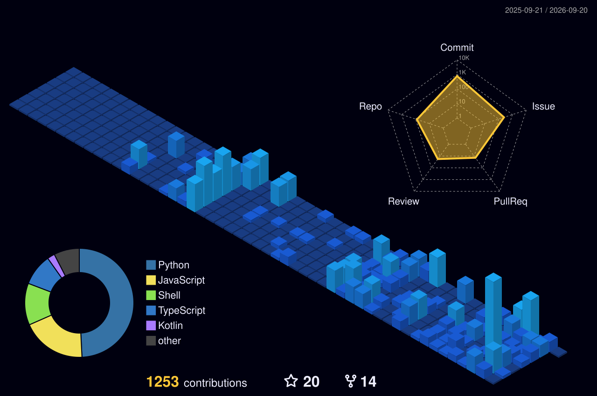

<!--
================================================================================
 MR. AMIT KUMAR · TECHHACKONTIME999 — GITHUB PROFILE README v3
 Design system: taste-skill (high-agency frontend protocol)
   · Palette   : Zinc-950 base (#09090b) + ONE accent — Emerald (#34d399)
   · Type      : Outfit (display) + JetBrains Mono (mono)
   · Motion    : Animated banner, typing loop, 3D contrib graph, snake,
                 activity graph, streak engine — all self-updating widgets
   · Rules     : No purple/blue AI gradients · No neon glows · No emoji soup
 HOW TO MODIFY (fast reference)
   · Name / headline ......... edit the capsule-render URL in HERO
   · Rotating tagline ......... edit "lines=" in the typing-svg URL
   · Role chips ............... edit the shield badge row under HERO
   · Accent color ............. find-replace 34d399 (light) / 10b981 (mid)
                                / 134e4a (deep) across this file
   · Projects ................. copy the PROJECT TEMPLATE block in FLAGSHIP BUILDS
   · 3D graph theme ........... swap the  line in THE 3D ZONE
   · Deep-dive docs ........... expand/collapse the <details> blocks
================================================================================
-->

<div align="center">

<!-- HERO BANNER — custom asset. To revert to the generated 3D capsule, paste:
     https://capsule-render.vercel.app/api?type=cylinder&height=240&color=0:09090b,50:0f172a,100:134e4a&text=AMIT%20KUMAR&fontSize=60&fontColor=e2e8f0&fontAlignY=45&desc=CO-TECHNICAL%20LEAD%20%40%20AWS%20SBG%20%C2%B7%20GEC%20BUXAR%20%C2%B7%20FOUNDER%20%E2%80%94%20SHOP-SEED%20%C2%B7%20NEURAL%20AURORA%20%C2%B7%20LINKUP&descSize=13&descAlignY=70&animation=fadeIn&font=Outfit -->
<a href="https://neural-aurora.vercel.app">
  
</a>

<br>

<!-- ROTATING TAGLINE — edit lines= to change what types out -->


<br><br>

<a href="https://github.com/Techhackontime999">
  
</a>
<a href="https://github.com/Techhackontime999?tab=followers">
  
</a>
<a href="https://github.com/Techhackontime999?tab=repositories">
  
</a>


<br><br>

<!-- ROLE CHIPS — edit text/colors freely -->


</div>

---

## ABOUT

<table>
<tr>
<td width="56%" valign="top">

**Mr. Amit Kumar** — known online as **Techhackontime999**. I turn ideas into working products: real architecture, real deployment, real users.

- **Currently building** — production-level backend systems and AI-powered platforms
- **Leading** — Co-Technical Lead, AWS Student Branch Chapter community at GEC Buxar
- **Founding** — [Shop-Seed](#flagship-builds) · Neural Aurora · LinkUp
- **Learning** — advanced system design and scalable architecture
- **Researching** — applied AI and innovation as a student researcher
- **Ask me about** — Python, Django, APIs, databases, backend logic
- **Goal** — technology that solves real-world, rural, and scalable problems
- **Philosophy** — idea → architecture → code → deployment → iteration

</td>
<td width="44%" valign="top">

<div align="center">


<br><br>


</div>

</td>
</tr>
</table>

---

## CONNECT

<div align="center">

<a href="https://github.com/Techhackontime999">
  
</a>
<a href="https://www.linkedin.com/in/mr-amit-kumar-bb8088296">
  
</a>
<a href="https://leetcode.com/u/techhackontime999/">
  
</a>
<a href="https://codeforces.com/profile/Techhackontime999">
  
</a>
<a href="https://x.com/Techhackontime">
  
</a>
<a href="https://www.youtube.com/@Techhackontime999">
  
</a>
<a href="https://www.instagram.com/techhackontime999/">
  
</a>
<a href="https://www.facebook.com/profile.php?id=61559725537190">
  
</a>
<a href="https://neural-aurora.vercel.app">
  
</a>

</div>

---

## MY PORTFOLIO

<div align="center">

<a href="https://neural-aurora.vercel.app" target="_blank">
  
</a>

<br><br>

<a href="https://neural-aurora.vercel.app">
  
</a>

</div>

---

## RESUME & BUSINESS CARD

<div align="center">

<!-- Relative links with ?raw=true trigger direct downloads and work on any branch -->
<a href="resume.pdf?raw=true">
  
</a>
<a href="business_card.png?raw=true">
  
</a>

<br><br>

<a href="business_card.png?raw=true">
  
</a>

</div>

---

## FLAGSHIP BUILDS

<table>
<tr>
<td width="50%" valign="top">

### LINKUP
**Open-source professional networking platform.** Social media — not to consume, but to create. Real-time feeds, chat, jobs, and discovery on a production-grade Django core.

`Django 5.2` `Channels` `PostgreSQL` `Redis` `Tailwind` `WebSockets`

50,000+ lines · 300+ structured files · contribution-ready

<a href="https://github.com/Techhackontime999/LinkUp">Repository</a> · <a href="https://www.linkedin.com/posts/mr-amit-kumar-bb8088296_day15-buildinpublic-django-activity-7426269570849513472-iN7D?utm_source=share&utm_medium=member_desktop&rcm=ACoAAEeO5LwBhtIyKEwjkpTvuw-f2H2_NmbkDxE">Demo video</a>

</td>
<td width="50%" valign="top">

### NEURAL AURORA
**Open-source portfolio infrastructure for everyone.** Dynamic portfolio platform with docs, CRM, teams, business, and enterprise tiers growing around the same core.

`JavaScript` `TypeScript` `MIT` · Live at [neural-aurora.vercel.app](https://neural-aurora.vercel.app)

Family: `docs platform` `CRM` `cloud` `app` `enterprise tiers`

<a href="https://github.com/Techhackontime999/NEURAL-AURORA">Core repo</a> · <a href="https://github.com/Techhackontime999/neural-aurora-docs">Docs platform</a>

</td>
</tr>
<tr>
<td width="50%" valign="top">

### SHOP-SEED
**AI-powered production-grade e-commerce platform.** Multi-role B2B/B2C commerce: seller dashboards, session carts, coupon logic, media handling, admin control.

`Python` `Django` `Signals` `Context Processors` `Media Handling`

Public mirror maintained alongside private production builds.

<a href="https://github.com/Techhackontime999/An-Ecommerce-Site">Public mirror</a> · <a href="https://www.linkedin.com/posts/mr-amit-kumar-bb8088296_django-python-webdevelopment-activity-7405807005019451393-Bure?utm_source=share&utm_medium=member_desktop&rcm=ACoAAEeO5LwBhtIyKEwjkpTvuw-f2H2_NmbkDxE">Demo video</a>

</td>
<td width="50%" valign="top">

### DRSERVE
**Hospital and patient management system.** Modular Django apps digitizing registration, doctor mapping, appointments, and medical publishing.

`Django 5.1` `Multi-app architecture` `Tailwind` `Gunicorn`

Architecture: `HospitalApp` · `DRAppointment` · `DR_BLOG` · `DR_Feature` · `MediJeevan`

<a href="https://www.linkedin.com/posts/mr-amit-kumar-bb8088296_this-is-my-hospital-patent-management-system-activity-7404671045393170432--C6y?utm_source=share&utm_medium=member_desktop&rcm=ACoAAEeO5LwBhtIyKEwjkpTvuw-f2H2_NmbkDxE">Demo video</a>

</td>
</tr>
<tr>
<td width="50%" valign="top">

### A-B-H-A-Y
**Anonymous complaint and justice support platform.** Safe reporting flows for people who need to be heard without being exposed.

`TypeScript`

<a href="https://github.com/Techhackontime999/A-B-H-A-Y">Repository</a>

</td>
<td width="50%" valign="top">

### LENS
**API-first attendance system.** Headless attendance infrastructure designed for integrations, automations, and clean API contracts.

`TypeScript`

<a href="https://github.com/Techhackontime999/lens">Repository</a> ·


</td>
</tr>
<tr>
<td width="50%" valign="top">

### OPEN-SOURCE STARTER LAB
**Beginner-friendly open-source lab.** Good first issues for Git, GitHub, PRs, CI, TypeScript CLI, and maintainer practice — my on-ramp for new contributors.

`TypeScript` `MIT` `CI` `Good First Issues`

<a href="https://github.com/Techhackontime999/open-source-starter-lab">Repository</a> ·


</td>
<td width="50%" valign="top">

### PRODUCTION CLIENT FLEET
**10+ deployed hospital and clinic systems** built and shipped for real operators — from children's hospitals to maternity and specialty clinics.

`Maa Mundeshwari Children Hospital` · `VK Global Hospital` · `City Hospital` · `Maa Sharda Sanjeevani` · `Sabit Khidmat` · `Mohini Women's Care` · `Rashmi Maternity` · `Saheb Medical` · `Dr Girija Tiwari Clinic` · `Dr Abhishek Kumar Clinic`

</td>
</tr>
</table>

<details>
<summary><strong>DEEP DIVE — LinkUp: full specification</strong></summary>

| Category | Details |
|---|---|
| Version | `v1.2.0` |
| Backend | Django `5.2` |
| Database | PostgreSQL |
| Frontend | Tailwind CSS + AJAX |
| Real-time | WebSockets + Django Channels + Redis |
| Deployment | Gunicorn + Whitenoise |
| Codebase | `50,000+` lines · `300+` structured files |

**Feature map**

- **User system** — signup/login, profile management, follow/unfollow
- **Content system** — rich-text posts, image/video uploads, real-time like/comment/share
- **Real-time chat** — WhatsApp-style private messaging over WebSockets
- **Jobs** — post jobs, apply, manage applications end-to-end
- **Discovery** — global search with smart filters
- **Notifications** — real-time + email notifications

**Production posture** — secure auth and permissions, optimized ORM queries, Redis caching, Channels WebSocket layer, deployable to Heroku / AWS / VPS.

**Why contribute** — real architecture beyond tutorial projects, mentorship, and a codebase built for open-source onboarding.

> Building LinkUp taught me how real social platforms are engineered — from database design to deployment.

</details>

<details>
<summary><strong>DEEP DIVE — DrServe: module architecture</strong></summary>

| Application | Responsibility |
|---|---|
| `HospitalApp` | Core hospital logic |
| `DRAppointment` | Appointment scheduling |
| `DR_BLOG` | Medical blog and awareness |
| `DR_Feature` | Additional hospital features |
| `MediJeevan` | Extended healthcare functionality |
| `DR_SERVE` | Main project configuration |

Digital patient registration, specialization-based doctor management, time-slot scheduling, secure structured data models — SQLite in development, PostgreSQL/MySQL ready in production.

</details>

<details>
<summary><strong>DEEP DIVE — Shop-Seed: commerce engine</strong></summary>

- **Auth** — signup, login, forgot password
- **Roles** — separate customer/seller registration, seller dashboard
- **Catalog** — product listings with images, categories, rich descriptions
- **Workflow** — session cart, checkout flow, order summary, coupon and discount logic
- **Admin** — customized panel, inventory and content control
- **Concepts** — Signals, Context Processors, Forms, Media handling, MVT reusable apps

</details>

<details>
<summary><strong>PROJECT TEMPLATE — copy this block to add a new flagship</strong></summary>

```markdown
### [PROJECT NAME]
**[One-line positioning.]** [What problem it solves and for whom.]

`Tech` `Tech` `Tech`

[One measurable highlight.]

<a href="[REPO_URL]">Repository</a> · <a href="[DEMO_URL]">Live / Demo</a>
```

Rule: show enough here to make someone interested — keep installation, API docs, and folder structure inside the repository's own README.

</details>

---

## TECH ARSENAL

**Languages**

<p>
  <a href="https://skillicons.dev"></a>
</p>

**Backend and data**

<p>
  <a href="https://skillicons.dev"></a>
</p>

**Frontend and ops**

<p>
  <a href="https://skillicons.dev"></a>
</p>

**Primary stack** — `Python` `Django` `PostgreSQL` `Redis` `WebSockets` `REST APIs` `JavaScript` `Linux` `Git`

---

## THE 3D ZONE

<div align="center">

<!-- DEFAULT 3D THEME — swap the filename below to change themes -->


<details>
<summary><strong>3D THEME SWITCHER — pick a different skyline</strong></summary>
<br>
Move one of these lines above the default image to activate it. Regenerate anytime with the <em>github-profile-3d-contrib</em> GitHub Action.

| Theme | Line to paste |
|---|---|
| Night View *(default)* | `profile-3d-contrib/profile-night-view.svg` |
| Night Green (static) | `profile-3d-contrib/profile-night-green.svg` |
| Green Animated | `profile-3d-contrib/profile-green-animate.svg` |
| Night Rainbow | `profile-3d-contrib/profile-night-rainbow.svg` |
| Rainbow + Border | `profile-3d-contrib/profile-night-rainbow-with-border.svg` |
| Season Animated | `profile-3d-contrib/profile-season-animate.svg` |
| South Season Animated | `profile-3d-contrib/profile-south-season-animate.svg` |
| Git Block | `profile-3d-contrib/profile-gitblock.svg` |

</details>

<br>

<!-- CONTRIBUTION SNAKE — requires the snake workflow pushing to the output branch -->


</div>

---

## ANALYTICS ENGINE

<div align="center">


<br><br>


<br><br>


<br>


</div>

---

## HOW I BUILD

```text
PROBLEM → REQUIREMENTS → ARCHITECTURE → DATA MODEL → BACKEND
       → INTERFACE → TEST & SECURE → DEPLOY → MEASURE → ITERATE
```

```text
Clean Code + Good Architecture + Useful Products + Security
            + Continuous Learning + Consistent Shipping = Better Engineering
```

Optimizing for: **maintainability** over complexity · **architecture** over hacks · **real problems** over feature overload · **security** from day zero · **performance** where it matters.

```text
Full-Stack → Backend → APIs → Databases → System Design
          → Scalable Architecture → AI Products → Product Engineering → Founding
```

> The goal is not just to make software work. It is to understand why it works, how it scales, and how it becomes a better product.

---

## OPEN COLLABORATION

Accepting collaboration on: **Django / Python backends** · **API engineering** · **database systems** · **performance optimization** · **security** · **testing and code quality** · **frontend/UI** · **documentation** · **AI-powered applications**.

Start here: [open-source-starter-lab](https://github.com/Techhackontime999/open-source-starter-lab) has good first issues reserved for new contributors.

If you're building something meaningful — let's build together.

<div align="center">

<br>

<a href="https://www.linkedin.com/in/mr-amit-kumar-bb8088296">
  
</a>
<a href="mailto:amitkumarkh01012006@gmail.com">
  
</a>
<a href="https://neural-aurora.vercel.app">
  
</a>

<br><br>

<a href="https://github.com/Techhackontime999">
  
</a>

**BUILD · LEARN · SHIP · REPEAT**

© 2026 Mr. Amit Kumar — Techhackontime999

</div>

<!--
================================================================================
 MAINTENANCE MANUAL
 WIDGET REFRESH
   · 3D graphs ............ run the "generate 3d-contrib" Action in this repo,
                            commit the new SVGs into profile-3d-contrib/
   · Snake ................ run the snake Action; it pushes to the `output`
                            branch which the image above reads from
   · Stats/streak/graph ... live services; they update themselves
 ASSETS IN THIS REPO
   · profile_picture.jpg ... avatar shown in ABOUT
   · profile_picture.jpeg .. alternate headshot (kept for future use)
   · profile_picture01.jpg . alternate headshot (kept for future use)
   · gif.gif ............... coding loop shown in ABOUT
   · banner_image.png ...... hero banner (revert URL kept in the HERO comment)
   · resume.pdf ............ one-click download in RESUME & BUSINESS CARD
   · business_card.png ..... card preview + download in same section
   · portfolio_image.png ... Neural Aurora preview in MY PORTFOLIO
   · LGTM/ ................. reaction images for PR reviews (see bin/make_lgtm.sh
                             and bin/change-border.py to generate more)
 CLAIMS
   · Keep numbers honest — update REPOSITORIES badge, line counts, and the
     client fleet list when reality changes.
 LINKS
   · Replace lnkd.in shortlinks with direct URLs whenever available.
 DESIGN RULES (taste-skill compliance)
   · One accent color (emerald). No purple/blue gradients, no neon glows,
     no emoji decoration, no pure black (#000).
================================================================================
-->
